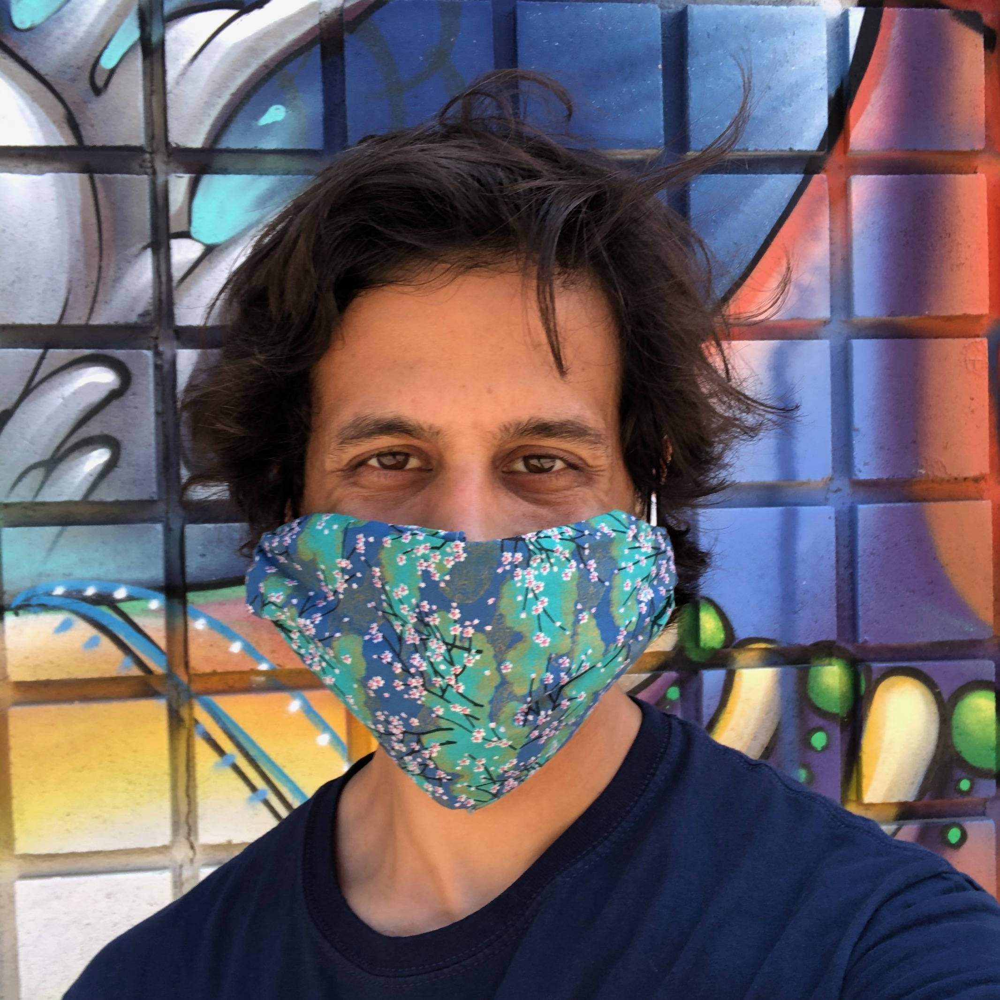

*25 April 2021: If you gather lots of PDFs, CSVs, and similar files from the internet, you might be interested in my R package 'heapsofpapers', available here: https://rohanalexander.github.io/heapsofpapers/.*

Hi, I'm Rohan Alexander.

```{r  out.width = "30%", echo = FALSE}
 
```

I am an Assistant Professor in [Information](https://ischool.utoronto.ca/profile/rohan-alexander/) and [Statistical Sciences](https://www.statistics.utoronto.ca/people/directories/all-faculty/rohan-alexander) (jointly-appointed) at the University of Toronto, Canada. I am a faculty affiliate at the [Schwartz Reisman Institute for Technology and Society](https://sr-institute.utoronto.ca/).

I'm interested in the entire applied statistics workflow and especially how decisions made at one point affect another. This involves gathering, cleaning, preparing, and sharing data; analyzing data using various statistical methods; and finally sharing these results. My [academic work](https://rohanalexander.com/academic.html) typically involves first constructing new datasets in a reproducible way, drawing on methods including digitization, record matching, survey collection, and web-scraping. I then use quantitative methods to analyse them, drawing on techniques from natural language processing, machine learning, and Bayesian methods, as appropriate. As my work is focused on individuals, issues of privacy and consent are of critical importance, and exist within my broader research interests at the intersection of data and ethics. My [research group](https://rohanalexander.com/lab.html) exists to bring this all together and provide opportunities for the training of undergraduate and graduate students.

My teaching notes are here: [Telling Stories With Data](https://www.tellingstorieswithdata.com/). I enjoy [teaching](https://rohanalexander.com/teaching.html) and aim to help students from a wide range of backgrounds learn how to use data to tell convincing stories. In Winter 2021 I am teaching ['Experimental Design'](https://rohanalexander.com/inf2178.html) in Information and leading a reading course ['Ethics and Data Science'](https://rohanalexander.com/reading_course-ethics.html). In Statistical Sciences I have taught ['Surveys, Sampling, and Observational Data'](https://rohanalexander.com/sta304.html). I am an [RStudio Certified Tidyverse Trainer](https://education.rstudio.com/trainers).

I co-organize the weekly [Toronto Data Workshop](https://rohanalexander.com/toronto_data_workshop.html), which is more fun than it sounds. All welcome! Sign up [here](https://forms.gle/sXbEixoa1iJR4Q7A8).

I am organizing a conference on reproducibility in applied statistics that will be held via Zoom on Thursday and Friday 25-26 February 2021. You can learn more [here](https://rohanalexander.com/reproducibility.html). 

<!-- With [Lauren Kennedy](https://jazzystats.com/) at Monash University, I co-organize a weekly MRP Reading Group. Please [get in touch](mailto:rohan.alexander@utoronto.ca) if you'd like to attend. -->

<!-- Based on my academic research I run a political poll in Australia: [Petit Poll](https://petitpoll.com). This combines non-representative polling data that we gather ourselves with a hierarchical Bayesian model to cheaply deliver meaningful Australian political polling. -->

Finally, I probably spend too much money on books, and certainly too much time at libraries (in a pre-COVID world). You can see some of the books that I recommend [here](https://rohanalexander.com/bookshelf.html). If you have any book recommendations of your own, I've love to hear them.

[Academic CV](pdfs/cv-academic-Rohan_Alexander.pdf)  
<!-- [Professional CV](pdfs/cv-professional-RohanAlexander.pdf) -->
