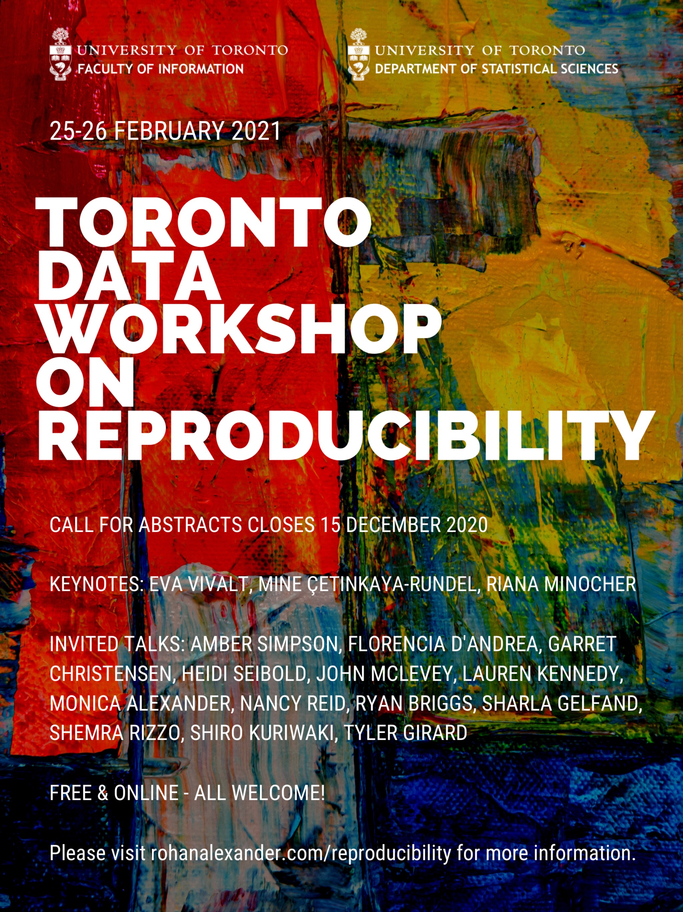

# Overview 

The Faculty of Information and the Department of Statistical Sciences at the University of Toronto are excited to host a two-day conference bringing together academic and industry participants on the critical issue of reproducibility in applied statistics (very broadly defined). The conference will be hosted online on Thursday and Friday 25-26 February 2021. Everyone is welcome and you can register [here](https://forms.gle/txLw43Q7UsXjzQys8).

Keynotes: 

- [Eva Vivalt](http://evavivalt.com/) (University of Toronto);
- [Mine Çetinkaya-Rundel](https://www2.stat.duke.edu/~mc301/) (University of Edinburgh); and
- [Riana Minocher](https://www.eva.mpg.de/ecology/staff/riana-minocher.html) (Max Planck Institute for Evolutionary Anthropology).

Invited presentations: 

- [Amber Simpson](http://www2.cs.queensu.ca/people/profile.php?fname=Amber&lname=Simpson) (Queen's University);
- [Florencia D'Andrea](https://florencia.netlify.app/) (Argentine National Institute of Agricultural Technology);
- [Garret Christensen](https://www.ocf.berkeley.edu/~garret/) (Federal Deposit Insurance Corporation);
- [Heidi Seibold](https://www.helmholtz.ai/themenmenue/our-research/research-groups/seibolds-group/index.html) (Helmholtz AI);
- [John McLevey](https://www.johnmclevey.com/) (University of Waterloo);
- [Lauren Kennedy](https://jazzystats.com/) (Monash University);
- [Monica Alexander](https://www.monicaalexander.com/) (University of Toronto);
- [Nancy Reid](http://www.utstat.utoronto.ca/reid/) (University of Toronto);
- [Ryan Briggs](https://www.ryancbriggs.net/) (University of Guelph);
- [Sharla Gelfand](https://sharla.party/) (Freelance R Developer);
- [Shemra Rizzo](https://www.linkedin.com/in/shemra) (Genentech); 
- [Shiro Kuriwaki](https://www.shirokuriwaki.com/) (Harvard University); and 
- [Tyler Girard](https://www.tylergirard.com/) (Western University).

If you would like to attend, then please register [here](https://forms.gle/txLw43Q7UsXjzQys8).

# Call for abstracts

If you would like to present a paper then please register and submit an abstract [here](https://forms.gle/txLw43Q7UsXjzQys8). Abstracts are due 15 December 2020. Notification of acceptance will occur a week or two after that. 

Folks who have traditionally been under-represented in statistics are especially encouraged to apply.

We welcome anything to do with reproducibility, but the conference has four broad areas of focus:

- **Applications of reproducibility:** Do you have an example and/or case studies of especially reproducible work? What are these gold standards, what makes them great, and how can we all achieve this standard?
- **Evaluating reproducibility:** Have you tried to systematically look at the extent of reproducibility in a field? Does, say, economics fall flat while demography shines? How did you go about your study? What aspects contributed to your findings?
- **Practices of reproducibility:** Have you developed some tools and approaches that make reproducibility easier? 
- **Teaching reproducibility:** How can we ensure that today's undergraduate and graduate students don't repeat the mistakes of earlier generations? What are some case studies that show promise?

# Details

Free and online via Zoom. 

Everyone is welcome. You don't need to be affiliated with a university.

If you would like to attend, then please sign up [here](https://forms.gle/txLw43Q7UsXjzQys8).

```{r, out.width= "95%"}
 
```
